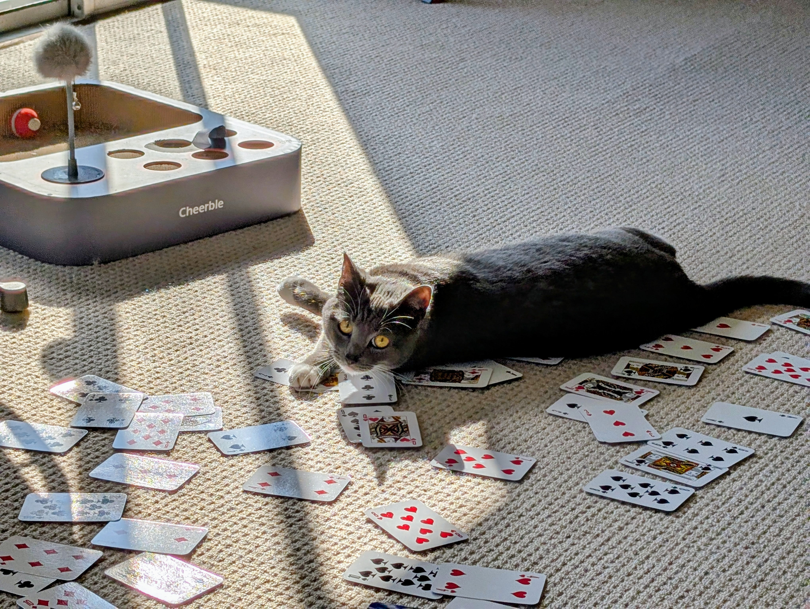

# Cardstream crypto system

This is a simple cryotographic system for manual encryption and decryption of
secret messages between two people who share half a deck of cards, where both
halves are ordered the same way, where red cards match red cards, and black
cards match black cards, such as ace of clubs matching ace of spades.

It is already known not to be secure by modern cryptographic standards.  There
are slightly more 0's in the output than 1's for example.  However, for use
over a short set of short messages, say a few thousand chacarters in total, the
goal of this system is to leak too few bits of information to be of use to an
attacker.

## Motivation

Bruce Schneier's [Solitaire](https://en.wikipedia.org/wiki/Solitaire_(cipher))
is cool, but:

1) Its output card stream is not very random compared to true random.
2) We have to do a lot of work per output card.

The idea here isn't to make the output to be indistiguishible from random.
Instead, the idea is to see how simple and fast we can make the system, while
having enough randomness to be useful for encrypting short messages.

## When this _might_ be useful

When a one-time-pad is practical, it should be used rather than this scheme.
This scheme is really only good for a total of messages that have a short
combined length, such as might fit on a few sheets of paper.  If there is no
harm in being caught with a few sheets of random characters, then a
one-time-pad is clearly preferred.

This scheme should also never be used for computers to communicate, since far
more secure schemes exist, e.g. AEAD schemes such as AES-GCM.

That leaves the case where a person does not want to get caught with a
one-time-pad, as this would be incriminating, and for some reason, they won't
have access to air-gapped computers when they need to encrypt a message.
Several spys in World War II were convicted in part because they were caught
with one-time-pad data.

The most useful case is probably when using a time machine to go back to when
computers did not exist.  Or maybe in a dystopian future after our machines
kill most of us.

## Generation of the one-time-pad data

The purpose of the half-deck of cards shared between two people is to enable
them to create a one-time-pad of nearly random letters, from A to Z, up to
maybe a few thousand letters.

### Encryption

Assign A = 1, B = 2, ... , Z = 26.  Simply add the values of the letter of
plaintext to the corresponding letter from the one-time-pad, wrapping around
such that Z + A = A, and Y + C = B.  Be sure to use the letter from the
one-time-pad only once, ever, or security for the encrypted messages is lost.

```
One-time-pad: IVEH
Message     : LOVE
Cyphertext  : UKAM
```

The table for value to letter to card is:

```
1 A BA
2 B B2
3 C B3
4 D B4
5 E B5
6 F B6
7 G B7
8 H B8
9 I B9
10 J B10
11 K BJ
12 L BQ
13 M BK
14 N RA
15 O R2
16 P R3
17 Q R4
18 R R5
19 S R6
20 T R7
21 U R8
22 V R9
23 W R10
24 X RJ
25 Y RQ
26 Z RK
```

### Decryption

Simply subtract the letter from the one-time-pad rather than add to reverse the process.

## Card stream generation

Card streams can be generated by both parties before they are needed, speeding
up encryption and decryption afterwards.  26 cards are in each half deck: black
and red versions of A, 2, 3, ... , Q, K.  Both decks are in the same random
order.  This order is the secret key.

A full deck is less weird than a half deck. so 2 separate keys can be encoded.
If he first half-deck gets out of sync due to a mistake, they can switch to the
second.  Simply shuffle a first deck, and sort a second in the exact same
order.  Two half decks are extracted by putting all clubs and diamonds in one
deck and spades and hearts in the other.

### Setup

Place 2 rows of 13 cards on a table face-up.  Flip over the lower left card
face-down.  The face-down card is the "current position".  We "increment" the
position by turning the current position card over, and turning over the card 1
to the right, or if at the end, the first card in the other row.

The "value" of a card is 1 for the black ace, 13 for the black king, 14 for the
red ace, and 26 for the red king.  The value of a card is counted from the
current position to find its "target" card.  For example, if the current card
is 4th from the bottom left, and the card in this position is a red 2, then the
target is in the 5th position on the upper row.  Counting starts at the current
position.  Given a black three, count "one, two three", starting at the current
position to select the card two spots to the right of the current position.

To produce a card in the card stream:

1) If the card in the current position is the black ace, increment the current
position and repeats step 1.
2) Flip over the target card of the first card to find the second card.
3) Flip over the target card of the second card to find the third card, which
can be the same as the first card, if the second card is the black ace.
4) Add the 3rd card to the output card stream.
5) If the 3rd card is not the same as the first, then "rotate" the 3 face-up cards.
6) Increment the current position.

To rotate 3 cards, the first card moves to the third card's position, the
second card moves to the first card's position, and the third card moves to the
second card's position.  For example, if the current position is 4th from the
bottom left, we might see:

```
XXX XXX XXX XXX XXX XXX XXX XXX XXX XXX XXX XXX XXX
B8  XXX XXX *RJ R3  XXX XXX XXX XXX XXX BJ  XXX XXX
```

Initially we just have RJ showing, but adding 13 to account for the 'R' in RJ
takes us to the upper row in the 4th position, just above the current position.
Then we count right by 11, saying "one" at the upper 4th card.  We reach 10 at
the upper right card, so we overflow to the lower left position.
Alternatively, you can see that RJ means 3 positions to the left of the current
position.  You'll be doing this rapidly after just a few minutes.

The second card is found by adding the value of B8, which is just 8, to the
current position, which is the position third from the last in he bottom row.

The rotation moves RJ to the space held by BJ, B8 moves to the space held by
RJ, and BJ moves to the space held by R8.  Note that the output card, in this
case BJ is never moved to the current position, as that would give the attacker
too much information.

```
XXX XXX XXX XXX XXX XXX XXX XXX XXX XXX XXX XXX XXX
BJ  XXX XXX B8  *R3 XXX XXX XXX XXX XXX RJ  XXX XXX
```

Note that this rotation is invertible, ensuring we do not lose entropy in the
deck as we generate the card stream.

## Security

History has shown that most proposed cryptographic schemes are easily broken.
Only extensive cryptanalysis by experts can begin to offer confidence in a
scheme, and this new scheme currently has none.  That said, here's a start,
from my own cryptanalysis.

### Distinguishing vs random stream

This scheme is already "broken", in that it is trivial to distinguish the
output from truly random numbers.  Because of this, the scheme should never be
used by computers to encrypt messages, since more secure schemes exist.

To test if a card stream is not random, count the number of black aces.  There
are about 4.2% more black aces in the generated card stream vs random.

However, to get a clear answer, the card stream needs to be fairly long.  The
first 100 cards could easily have no black aces.  To have confidence, we need
enough cards for the average number of black aces to converge to within a
couple of percent with reasonable probability.  If the user only uses say 1,000
total cards from this scheme, we expect only 1.6 too many black aces, clearly
in the noise.

### Brute force guessing

There are only 2^88 possible ways to shuffle 26 cards (26 factorial).  This is
not considered secure by modern standards, where we prefer over 100 bits to be
considered secure vs classical computers, and double that vs quantum computers.

However, it is _close_ to being secure.  It would be surprising to see an
attacker recover a random key for under $1M in 2025.


### Dieharder results

Most tests pass, such as birthday collisions, which is somewhat surprising.
However, STS Monobit, the NIST test for number of 1's vs 0's, fails as
expected.  Several other tests fail as well.  See dieharder.results to see the
results of tests I ran.

### Letter probabilities

The max is 3.99%, and the min is 3.83%, so a black ace is 4.2% more likely than
some other letters such as a black 3.  Other than this, the probabilities
differ by less than 0.3%.

```
BA 3.99%
B2 3.84%
B3 3.83%
B4 3.83%
B5 3.83%
B6 3.84%
B7 3.83%
B8 3.83%
B9 3.83%
B10 3.83%
BJ 3.83%
BQ 3.83%
BK 3.84%
RA 3.84%
R2 3.84%
R3 3.83%
R4 3.83%
R5 3.83%
R6 3.83%
R7 3.84%
R8 3.84%
R9 3.83%
R10 3.83%
RJ 3.84%
RQ 3.84%
RK 3.84%
```

### Next letter probabilities

The following table shows how many 2-letter combinations occurred in a sample
of of 200,000,000.  The black ace repeating is the largest, with 318523 vs an
average of 295,858, which is 7.7% higher than average.

For decks that only ever generate a few thousand cards, it is unclear to me how
to make use of these biases.  The would have little impact on my attempt to
determine that a 1000-letter card stream is not random.

```
BA: 318523, 308315, 306520, 306452, 306844, 307649, 306390, 307361, 307988, 308267, 307841, 306892, 307812, 307143, 306600, 306611, 307440, 307026, 308489, 307217, 307029, 306868, 307754, 306568, 306811, 308376
B2: 308016, 293627, 296341, 295090, 295166, 295103, 295091, 294167, 294716, 295597, 295078, 295154, 294837, 295134, 295780, 294930, 295199, 295009, 294280, 295265, 295180, 294824, 294722, 294982, 295678, 309407
B3: 308476, 311628, 294220, 293747, 293558, 293899, 294639, 294062, 294587, 294553, 292490, 293912, 294082, 294074, 294577, 294842, 295067, 294429, 294370, 294504, 294725, 293645, 293962, 293175, 293985, 295293
B4: 306823, 295725, 308910, 294754, 293517, 292887, 294170, 294274, 294659, 293991, 294293, 294141, 294680, 295051, 293748, 294153, 295149, 294347, 294383, 293875, 294466, 295004, 294349, 294206, 292955, 293973
B5: [307725, 296585, 294746, 309625, 294204, 292371, 294018, 294182, 294262, 294986, 293798, 293940, 294219, 295033, 294410, 293257, 293461, 294427, 293849, 294257, 293489, 294287, 293914, 293737, 293823, 295492
B6: 307312, 296514, 294241, 294191, 308785, 293933, 294031, 292776, 293457, 294453, 295224, 294317, 294200, 294722, 295166, 294457, 293543, 294404, 293991, 294326, 294654, 294636, 294045, 294624, 293074, 293861
B7: 306498, 296236, 295060, 294218, 293654, 309342, 293692, 292363, 293088, 294059, 294113, 293630, 295159, 293812, 294031, 295881, 295223, 294733, 294040, 294322, 294491, 294428, 295059, 294874, 294788, 295126
B8: 307616, 295426, 294990, 293780, 294483, 293622, 310144, 292908, 294018, 293499, 294227, 294241, 294451, 293525, 294581, 293279, 294084, 294349, 294252, 293243, 294136, 294381, 294156, 294101, 294424, 295757
B9: 306871, 296053, 293952, 293766, 294811, 294593, 294815, 309546, 292743, 293938, 293963, 294253, 294113, 294965, 292788, 294892, 294629, 293255, 294045, 294140, 294785, 293645, 293327, 293518, 294299, 296047
B10: 307967, 295737, 294971, 293691, 294885, 294037, 292660, 295292, 309465, 293371, 294451, 293984, 294410, 294322, 294499, 294611, 294652, 294657, 293731, 293858, 294256, 294806, 294176, 294110, 295339, 295351
BJ: 306792, 296393, 294619, 294006, 293695, 294571, 295179, 294161, 294737, 309696, 293509, 293505, 292804, 294142, 294180, 294793, 294088, 294921, 294428, 293589, 294241, 294054, 294060, 293392, 294373, 294457
BQ: 306624, 296020, 294058, 293450, 294212, 294336, 295033, 293415, 294292, 294482, 309631, 293255, 293305, 293387, 294159, 294571, 293550, 293939, 294605, 294705, 294597, 295130, 294070, 292967, 294368, 293772
BK: 307343, 296388, 294769, 294295, 293927, 294463, 294865, 294432, 294353, 294068, 293647, 309224, 293579, 293207, 293370, 294597, 294565, 294598, 294430, 293955, 293984, 294188, 293772, 295036, 294024, 294473
RA: 308366, 296133, 293902, 293811, 293752, 294895, 293806, 294176, 294376, 293539, 293834, 294141, 309703, 292525, 293481, 293517, 294460, 293698, 293711, 294139, 293923, 293264, 293867, 294014, 294180, 295800
R2: 307062, 296558, 294089, 294387, 294545, 294164, 294728, 294736, 293772, 294142, 294843, 294810, 294188, 308670, 294442, 294653, 292907, 293768, 294721, 294473, 294728, 294429, 294643, 293398, 294080, 294407
R3: 306830, 296225, 295302, 294496, 294420, 293805, 294602, 294826, 293535, 294576, 294305, 293923, 293952, 293706, 310697, 293876, 293510, 293260, 294567, 294969, 294613, 294449, 294649, 294714, 294228, 294377
R4: 307412, 295966, 293920, 293901, 294756, 293457, 292975, 293933, 294035, 293472, 293845, 294825, 295249, 293728, 294760, 309996, 293515, 293817, 294312, 294247, 294691, 293903, 294261, 294816, 294862, 294589
R5: 307443, 295629, 294013, 293735, 293602, 293733, 293931, 294817, 293824, 294455, 293962, 294132, 294526, 293777, 293592, 293925, 308669, 292453, 294347, 294515, 294183, 294041, 293783, 293983, 294265, 294832
R6: 307109, 296011, 294438, 294850, 293613, 294887, 295300, 295155, 293602, 295826, 294974, 293322, 293932, 293761, 294999, 294835, 294385, 308947, 293743, 293458, 293061, 293921, 294799, 294007, 294692, 295198
R7: 307339, 296496, 293521, 294633, 294662, 293619, 294324, 293992, 294825, 294279, 293760, 294528, 294188, 293946, 293993, 295003, 294196, 293254, 310580, 293057, 293056, 293672, 294244, 294034, 293767, 295412
R8: 307761, 296728, 293875, 294160, 293597, 295590, 293984, 293891, 294325, 294595, 293767, 293905, 294368, 295193, 294180, 293185, 293732, 294028, 295419, 309917, 293099, 294011, 293902, 293979, 294337, 294435
R9: 307208, 296503, 293621, 294441, 294187, 294761, 294789, 294207, 293987, 294663, 294010, 294860, 294878, 294624, 294386, 293744, 294646, 294245, 294145, 294443, 309185, 294455, 293065, 292519, 293598, 294750
R10: 307008, 296896, 293792, 293318, 294417, 294466, 294485, 294297, 294474, 293780, 295224, 293669, 294378, 293582, 294787, 293761, 294414, 293540, 294914, 293811, 294472, 309879, 293095, 293248, 293438, 293442
RJ: 306560, 296027, 294118, 295527, 293626, 293529, 294210, 293593, 294512, 293906, 293374, 293866, 293318, 293191, 294234, 294242, 294295, 293732, 294003, 294773, 294260, 293849, 309349, 293934, 292620, 293760
RQ: 306928, 295505, 292527, 294473, 294620, 294942, 293851, 295044, 294048, 295369, 294763, 294424, 293774, 293794, 294597, 294728, 293623, 293078, 293932, 293540, 294221, 294054, 293997, 308451, 294798, 294967
RK: 307174, 269049, 295986, 295686, 296559, 296283, 296208, 296067, 296072, 295727, 295459, 295080, 295447, 295999, 295306, 296073, 296240, 296253, 295538, 295782, 296438, 296097, 295567, 296021, 311243, 292655
```

### Predicting future outputs from the past

I hypothesize the problem of recovering the card state from any length of
outputs is difficult.  The current position is not known since the attacker
does not know when the black ace is in the current position, causing the
current position to increment without outputting a card.  Even a correct guess
of half of the card positions seems to lead nowhere, as unknown cards scramble
the known cards quickly, more rapidly than the case where two known cards
reveal the position of an unknown card.  After 26 to 260 cards are output, the
attacker no longer has statistically useful information about card positions,
depending on how we define "useful".  After 26 cards, no card position is known
with better than a few percent probability.

Without being able to recover the state of the deck from the output keystream,
the attacker is left with statistical attacks on ciphertext, which [can be
effective](https://www.rc4nomore.com/) because of biases in the card stream.
The main defense is avoiding sending the same plaintext encrypted with this
system many times, which can lead to recovery of the plaintext by the attacker.
For example, you would want to avoid having 10,000 troops being sent the same
message, say "attack at dawn", using this system, even if everone has different
deck states.

## Operating tips

### Do everything the same way on both sides

Agree on how to put down the cards.  I put the cards face-down in my hand, and
then place 13 cards face-up from the top of the deck from left to right,
followed by another row below that, left to right.

I start with the current position as the lower left card.  I find it more
natural to place the second row below the first.

Always compute target cards relative to the current position.  With a black 4,
I count one, two, three, four, starting with the current position, and moving
right.  If I hit the end, I start at the other row on the left.

Be sure to practice encryption and decryption with this scheme together, to
make sure you both are doing everything the same way.

### Double check everything

It is very easy to make a mistake, destroying both the card stream and the state
of the deck.  To avoid critical mistakes:

1) Lock your cat out of your room while you do this.
2) Write down the deck's initial order so you can recover if needed.
3) Have 2 decks, face-up in front of you, in the same order, and make sure they stay the same.
4) Do every operation twice, once on the first deck, then on the second.

I prefer to have all the cards face-up with both decks so I can spot an error
quickly.  I encode the current position by having that card face down.




## Examples

Make sure you agree with the following before and after states when using this
system, or send me a pull request if I made a mistake.

Skip the black ace.  If the card in the current position is the black ace, do
not record it in the output stream, and increment the current position.

```
XXX XXX XXX XXX XXX XXX XXX XXX XXX XXX XXX XXX XXX
XXX XXX XXX XXX *BA R3  XXX XXX XXX XXX XXX XXX XXX
==> Output nothing.
XXX XXX XXX XXX XXX XXX XXX XXX XXX XXX XXX XXX XXX
XXX XXX XXX XXX BA  *R3 XXX XXX XXX XXX XXX XXX XXX
```
The R3 is just an example of whatever follows the black ace.  The \* means the
current position.

If the second card is a black ace, record the card in the current position in
the output stream, and increment the position without any card rotation.

```
XXX XXX XXX XXX XXX XXX XXX XXX XXX BA  XXX XXX XXX
XXX XXX XXX XXX B4  *R5 BK  XXX XXX XXX XXX XXX XXX
==> Output R5, no rotation.
XXX XXX XXX XXX XXX XXX XXX XXX XXX BA  XXX XXX XXX
XXX XXX XXX XXX XXX R5  *BK XXX XXX XXX XXX XXX XXX
```

The red king selects the card one left of the current position.  The black king
selects the one left of the current position in the other row.

```
XXX XXX XXX XXX BA  XXX XXX XXX XXX XXX XXX XXX XXX
XXX XXX XXX XXX BK  *RK RJ  XXX XXX XXX XXX XXX XXX
==> Output BA, and rotate.
XXX XXX XXX XXX RK  XXX XXX XXX XXX XXX XXX XXX XXX
XXX XXX XXX XXX BA  BK  *RJ XXX XXX XXX XXX XXX XXX
```

Note that the output card is never rotated into the current position.  I
enforce this by starting he rotation with the output card, taking care not to
put it into the current position.

Overflowing while counting past the end of a row starts on the other row.

```
XXX B2  XXX XXX XXX XXX XXX XXX XXX XXX XXX XXX XXX
XXX XXX XXX XXX XXX XXX XXX XXX XXX XXX XXX *B4 RA
==> Output RA, and rotate.
XXX RA  XXX XXX RK  XXX XXX XXX XXX XXX XXX XXX XXX
XXX XXX XXX XXX XXX XXX XXX XXX XXX XXX XXX B2  *B4
```

Counting backwards wraps the same way.  I count backwards from the current
position for red face cards, and backwards on the other row for black face
cards.

```
*RK R3  XXX XXX XXX XXX XXX XXX XXX XXX XXX XXX B5
XXX XXX XXX XXX XXX XXX XXX XXX XXX XXX XXX XXX BK
==> Output B5, and rotate.
BK  *R3 XXX XXX XXX XXX XXX XXX XXX XXX XXX XXX RK
XXX XXX XXX XXX XXX XXX XXX XXX XXX XXX XXX XXX B5
```
